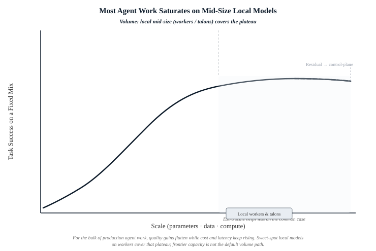

# Harness-First Agentic AI: Control Plane, Execution, and Governed Autonomy

**AAIAAS (Agentic Artificial Intelligence as a Service) Reference Architecture Whitepaper**  
**Version 1.3**
**July 2026**

---

## Table of Contents

1. [Executive Summary](#1-executive-summary)
2. [The Problem: Model-Centric Failure Modes](#2-the-problem-model-centric-failure-modes)
   - 2.1 Three Recurring Failure Patterns
   - 2.2 Why the Model-Centric Approach Fails
   - 2.3 Inference as Commodity, Second Brain as Value
   - 2.4 Production Default: Mid-Size Models + Harness
   - 2.5 Capability Placement by Plane
   - 2.6 Limits and Chunking under the Harness
   - 2.7 Control-Plane Headroom
   - 2.8 Local Inference Security Boundary
3. [Reference Architecture](#3-reference-architecture)
   - 3.1 Six Layers, Three Planes
   - 3.2 The Harness Layer: Five Invariants
   - 3.3 Execution Plane Invariants
   - 3.4 Tenant Isolation
4. [Control Plane and Worker Governance](#4-control-plane-and-worker-governance)
   - 4.1 Roles and Responsibilities
   - 4.2 Governance Controls
   - 4.3 Telemetry and Observability
   - 4.4 Managed Concurrency and Admission Control
5. [HITL Governance: Risk-Tiered Human-in-the-Loop](#5-hitl-governance-risk-tiered-human-the-loop)
   - 5.1 Risk Tiers
   - 5.2 Operation Permanence Classification
   - 5.3 Waiver Policy
   - 5.4 High-Risk Operation Catalog
   - 5.5 HITL as Operator Compounding, Not Only Approval
6. [OGACS: Execution Invariants and Operational Governance](#6-ogacs-execution-invariants-and-operational-governance)
   - 6.1 What Is OGACS?
   - 6.2 Enforcement Model
   - 6.3 Invariant Set
   - 6.4 Drift and Convergence
7. [Identity & Zero-Trust Alignment](#7-identity--zero-trust-alignment)
   - 7.1 Dual-Plane Architecture
   - 7.2 Identity & SSO Principles
   - 7.3 Zero Trust Principles
   - 7.4 Explicit Non-Claims
8. [Cognitive Compounding: Self-Improving Skill Loops](#8-cognitive-compounding-self-improving-skill-loops)
   - 8.1 The Evolutor Pattern
   - 8.2 How It Works
   - 8.3 Why This Matters
9. [Execution Planes: Cloud, Device, and Air-Gap](#9-execution-plans-cloud-device-and-air-gap)
   - 9.1 Cloud Execution: Multi-Tenant Worker Infrastructure
   - 9.2 Device Execution: Tenant-Local Workers
   - 9.3 Air-Gap Deployment
   - 9.4 Hybrid Configurations
10. [Deployment Topologies and Production Posture](#10-deployment-topologies-and-production-posture)
   - 10.1 Canonical Deployment Reference

---

## 1. Executive Summary

The prevailing narrative in enterprise AI focuses on models: which foundation model is best, which provider offers the best price-performance ratio, which prompt engineering technique unlocks the highest accuracy. This model-centric view produces systems that are fragile, opaque, and difficult to govern. When the model changes — and it will change — the entire system must be rebuilt.

The alternative is to flip the architecture. Place the model abstraction layer — the **Harness** — at the center of the design. Models become interchangeable commodities. Planning, policy, verification, and governance remain centralized and stable. Execution remains distributed, provider-agnostic, and resilient.

This whitepaper defines the **AAIAAS reference architecture**: a harness-first control plane for governed autonomy. Models are treated as interchangeable commodities. Planning, policy, verification, and proof remain stable. Execution is provider-agnostic across cloud, device, and air-gap planes.

The document is written for technical leaders, security architects, and operators evaluating autonomous systems for production. It specifies architectural layers, execution invariants, HITL governance, and operational constraints. Product branding, actor taxonomies, and implementation runbooks are maintained on the product surfaces and in separate operating guides.

The architecture delivers five capabilities that are rare in production:

1. **Provider-agnostic execution** — swap models without rewriting task logic
2. **Governed autonomy** — human-in-the-loop gates that scale with managed concurrency, rather than unmanaged agent sprawl
3. **Execution invariants** — circuit breakers, cost limits, and step ceilings that prevent runaway behavior
4. **Proof-of-execution** — every task produces tamper-evident audit artifacts
5. **Cognitive compounding** — skills that improve run-over-run through a closed self-improvement loop

The platform is deployed across three execution planes (cloud-shared, device-local, air-gapped), supports hybrid configurations where local inference assists without replacing central orchestration, and is designed to operate in sovereign or private environments where data residency requirements are strict.

Product-specific actor taxonomies and control-plane UI details are published on the product surface. This document defines the architectural invariants and governance model only.

---

## 2. The Problem: Model-Centric Failure Modes

### 2.1 Three Recurring Failure Patterns

Organizations that build autonomous AI systems around model capabilities — rather than around governance and control — encounter three predictable failure patterns:

**Pattern A: Waiting.** Recurring operational tasks that require a human to remember to execute them. Every Monday morning. Every Friday before audit. Every morning before standup. When the human forgets, the downstream process degrades silently. The task "works" in development but is fragile in production.

**Pattern B: Silent Degradation.** Automated processes that appear to function but whose outputs gradually drift from acceptable quality. No alert fires. No metric crosses a threshold. The degradation accumulates until something downstream breaks, and the root cause is hours or days of stale outputs.

**Pattern C: Talent Waste.** Engineers and operators spending time maintaining brittle scripts, monitoring broken automations, and manually extracting compliance evidence. This is work that could be expressed in a sentence and executed autonomously, but is treated as infrastructure glue.

These are not niche problems. They are the reason recurring revenue exists in enterprise software. The organizations that solve them are not building better models — they are building better control.

### 2.2 Why the Model-Centric Approach Fails

The dominant paradigm treats the model as the product. Engineering effort flows into prompt engineering, model selection, context optimization, and output refinement. Governance is bolted on after the fact as a secondary concern.

This produces fragile systems because:

- **Model swap requires rewriting.** When a provider is deprecated, pricing changes, or a better model emerges, the task logic must be re-engineered because execution and model coupling are inseparable.
- **Governance is inconsistent.** Ad hoc safety checks and manual approvals do not scale. Teams that cannot apply consistent risk-tiering under load cannot operate at production volume.
- **Audit trails are incomplete.** When every execution path is model-dependent and ad hoc, producing tamper-evident proof-of-execution for compliance is an engineering project, not a native capability.

The harness-first architecture inverts this priority. The model is a commodity input. The harness — the layer that provides provider isolation, verification, bounded execution, and governance — is the product.

### 2.3 Inference as Commodity, Second Brain as Value

Extending the harness-first principle: inference itself is a commodity. Models and providers are swappable inputs — you can change a model family, swap a cloud provider, or route to a local endpoint without rewriting task logic. The harness abstracts these away. What the operator pays for is not raw token volume or model capability; it is the **bespoke state** that each deployed executor accrues over time.

That bespoke state is the tenant-scoped second brain: a customized state vector comprising memory artifacts, executed skills, policy-bound history, and cognitive compounding patterns. Two tenants running the same model on the same harness will produce different outcomes because their second brains are different. The model is the engine; the second brain is the product.

This has implications for how organizations evaluate autonomous AI investment. The ROI does not come from which model you choose — it comes from how thoroughly the executor has learned your operational context, embedded your policies, and compounded its skills through execution. A well-tuned second brain running a commodity model outperforms a blank-slate executor on a premium model.

### 2.4 Production Default: Mid-Size Models + Harness

Most production agent workloads sit in the body of the difficulty distribution: retrieval and synthesis, structured extraction, scoped tool use, short-horizon planning, and verification against explicit contracts. For these tasks, a well-post-trained mid-size model (tens of billions of parameters) served efficiently often saturates quality. Further scale yields diminishing returns on the common case while increasing latency and cost.

The harness — planning, policy, admission control, verification before completion, and proof of execution — determines reliability more than raw parameter count. Provider-agnostic design routes bulk work to efficient mid-size models by default. Stronger models remain available where the architecture places them — primarily with control-plane orchestration and distillation — not as the volume path for every worker turn.

> For production volume, a strong mid-size model behind a real control plane is the rational default. Capability is placed by plane: local sweet-spot inference for workers and talons; control-plane headroom for governance and the rare cases that need it.

*Body work executes local on the plateau; control-plane capacity sits above the graph, not on every worker seat.*

### 2.5 Capability Placement by Plane

Capability is **placed by plane**, not treated as a temporary compromise.

- **Workers and talons** (execution volume): sweet-spot local mid-size inference on the body of the task distribution.
- **Cloud control plane** (governance): planning, admission, policy, and the rare steps that need more reasoning headroom.

For the body of production agent work, quality gains from further model scale diminish while cost and latency keep rising. The rational operating point sits on that plateau. Under SQDEC, that is efficient default placement: Safety and Quality set the bar; Economics and Delivery improve when volume stays on the plateau.

> Past the body plateau, further scale raises cost and latency faster than it raises success on typical workloads.

### 2.6 Limits and Chunking under the Harness

Mid-size models still underperform on long-horizon, weakly decomposable, or rare-knowledge work. The architecture does not claim otherwise. The harness addresses those limits by **chunking** large outcomes into short-horizon, verifiable units where local mid-size capacity is sufficient — one outcome per bite, with verification between bites.

Chunking is a control-plane move: map whole-meal jobs onto body-class units. Good chunking is sequential, verified work. Residual bites that remain hard after honest decomposition escalate **altitude to the control plane** (optional stronger control-plane inference), not every worker seat.

### 2.7 Control-Plane Headroom

When a step needs more headroom after decomposition and verification, stronger models assist **orchestration and hard judgment at the control plane**. Workers stay on efficient local inference. There is no silent always-on high-scale path on every worker turn; headroom is explicit, gated, and rare relative to volume.

### 2.8 Local Inference Security Boundary

When workloads use device-local, on-premises, or air-gap inference endpoints, sensitive content can be processed without sending that content to external cloud model providers. This is a capability of the deployment topology, not a property of the harness itself. The table below summarizes content residency by mode:

| Mode | Sensitive content to external model API? | Notes |
|------|------------------------------------------|-------|
| Device-local inference endpoint | No (stays on device / local network) | Co-processor; preprocessing, redaction, retrieval |
| Hybrid | Depends on task path | Cloud CP / cloud workers may still see admitted payloads |
| Air-gap | No outbound from execution plane | Strictest residency; model runs on local hardware |

Device-local inference is explicitly a **Harness Layer co-processor** (§10.2) — it assists with local retrieval, summarization, fact extraction, and privacy-preserving preprocessing without replacing strategic planning or policy authority in the control plane. Even when inference is local, the control-plane tether remains the orchestrator.

---
## 3. Reference Architecture

### 3.1 Six Layers, Three Planes.

The AAIAAS architecture is organized into six distinct layers, each with a bounded responsibility. This layering is not optional. Violating layer boundaries requires an architectural decision record and explicit review.

| Layer | Responsibility |
|-------|---------------|
| **Experience Layer** | User interfaces, dashboards, input capture |
| **Orchestration Layer** | Planning, routing, policy enforcement, task decomposition |
| **Harness Layer** | Model/tool abstraction, provider isolation, verification, governance |
| **Capability Layer** | Modular skills and connectors — provider-agnostic interfaces |
| **Execution Layer** | Workers that execute tasks on their assigned execution plane |
| **Memory Layer** | Tenant-segmented knowledge storage and retrieval |

These layers operate across three execution planes:

| Plane | Role |
|-------|------|
| **Control Plane** | Strategic orchestration, planning, policy, and governance |
| **Cloud Execution Plane** | Shared multi-tenant worker infrastructure |
| **Device Execution Plane** | Tenant-owned local or on-premises workers |

No plane may silently assume the responsibilities of another. Control plans and evaluates but does not execute. Execution workers execute but do not plan. This separation is the architectural invariant that makes governed autonomy possible.

### 3.2 The Harness Layer: Five Invariants.

The Harness Layer is the differentiator. It provides:

**Invariant 1 — Provider Isolation.** Provider-specific execution logic is confined to dedicated adapters. Task logic (skills) never embeds model-provider concerns. Swapping a model provider requires changing the adapter, not rewriting the skill.

**Invariant 2 — Provider-Agnostic Capabilities.** Skill semantics are defined independently of any model. A "browse the web" skill produces the same output contract whether powered by a GPT model, a Claude model, or a local open-source model.

**Invariant 3 — Graceful Degradation.** Optional enrichment steps (retrieval-augmented generation, planner critic passes, billing telemetry) degrade gracefully unless explicitly marked as hard-required by policy. Failures produce structured diagnostics, not cascading failures.

**Invariant 4 — Verification Before Completion.** Task completion requires satisfaction of verification policies. A task does not complete until its output is verified against the acceptance criteria defined in the task spec.

**Invariant 5 — Bounded Execution.** Task graph expansion obeys explicit depth and fan-out limits. The system will not generate infinitely recursive task chains. Every execution path has a ceiling.

Six additional Harness invariants enforce safety hierarchy (the safety tier of the SQDEC ordering is inviolable, regardless of economic or delivery pressure), tenant-segmented memory, artifact-separation discipline (durable artifacts remain externalized and addressable, not collapsed into prompt context), and execution capability verification (the Harness verifies that the target execution plane can satisfy required skill contracts before admitting a task graph into the pipeline).

### 3.3 Execution Plane Invariants.

The execution layer is governed by its own invariant set:

- **Plane Separation:** Control, cloud, and device responsibilities remain clearly delineated. No plane assumes the responsibilities of another.
- **Worker Traceability:** Every worker maintains a verifiable identity including worker ID, execution plane assignment, and authorized tenant set.
- **Proof-of-Execution:** Every completed task emits proof artifacts including execution metadata, artifact hashes, and verification signals.
- **Fail-Closed Execution:** Workers fail closed on unsupported skill types, invalid payload schemas, or missing authorization. Silent fallback execution is forbidden.
- **Tenant Authorization:** Worker authorization is evaluated against the worker's authorized tenant set. Device workers serve a single tenant. Cloud workers serve an authorized set. Cross-tenant execution is always auditable.

### 3.4 Tenant Isolation.

Every tenant undergoes a bootstrap lifecycle before activation: a defined provisioning sequence that establishes tenant record, settings, feature flags, memory namespace, public skill access, execution authorization, and observability scope. A tenant must not reach active status until all bootstrap resources exist. Authentication success alone does not imply readiness.

All tenant data and execution remain isolated. Cross-tenant data leakage is structurally forbidden by the architecture.

---

## 4. Control Plane and Worker Governance

### 4.1 Roles and Responsibilities.

The platform separates orchestration from execution:

**Control-plane orchestrator.** Receives intent, expands goals into task specifications, generates execution plans, and exercises human-in-the-loop approval authority. Orchestration logic lives in the control plane — never in the execution layer.

**Worker agents.** Execute tasks dispatched by the control plane on an assigned execution plane. Workers are capable and precise, but act only under control-plane direction. A worker that cannot report status or accept recall is treated as a system failure.

**Staging environment.** Local development and staging is where workers are trained, skills are developed, and configurations are tested before production deployment.

**Operator dashboard.** The elevated observation and decision surface where operators monitor task state, review HITL approval queues, and direct execution.

### 4.2 Governance Controls.

Three mechanisms keep autonomous execution safe:

**HITL gate.** Tasks at the High and Critical risk tiers are held behind a human approval gate. No task bypasses this silently. Approval is never removed by default — it requires explicit human action (approve, reject, or waive-by-action at the individual task level).

**Budget constraints.** Every worker has an associated cost envelope. Execution paths are bounded by per-task and per-session spending limits. When the envelope is exhausted, execution halts and reports — it does not continue silently.

**Control-plane tether.** Workers remain connected to the control plane through heartbeat signals and recall paths. Even workers running locally with local inference assistance are tethered to the central orchestrator. They can operate semi-independently but can always be recalled.

### 4.3 Telemetry and Observability.

Every worker emits telemetry at every lifecycle stage — planning, dispatch, execution, completion, and verification. Silent operation is not an option. Every task produces structured logs suitable for aggregation and analysis, with traceability across tenant, worker, execution plane, and skill.

### 4.4 Managed Concurrency and Admission Control.

Workers may execute in parallel as a capacity optimization — but parallelism is never an unmanaged default. The control plane exercises authoritative task admission and sequencing. Unbounded multi-agent execution without admission control is a governance failure mode: conflicting writes, undoable state, and unauditable outcomes — not operational maturity.

**Doctrine (reference):**
- Tasks are admitted by the orchestrator; workers do not self-dispatch or peer-schedule as peer orchestrators.
- Parallel workers are optional capacity under control-plane direction, not independent planners.
- Serial-first is the safe default; parallelism is introduced only when shared-state contention is controlled.

This is the difference between a choreographed fleet and agent sprawl: one orchestrator directing traffic under governance. Exact WIP bounds, admission algorithms, and deployment knobs are defined in operating guides and product configuration — not in this reference architecture.

---

## 5. HITL Governance: Risk-Tiered Human-in-the-Loop

### 5.1 Risk Tiers.

The platform classifies every operation into one of four risk tiers, and each tier has a defined approval requirement:

| Tier | Definition | Default Action |
|------|------------|---------------|
| **Low** | Routine, idempotent, or read-only operations with no security or cost impact | Auto-approve |
| **Medium** | State-changing operations with limited scope or reversible impact | Notify only |
| **High** | Critical state changes, significant cost implications, or security-sensitive actions | Require approval |
| **Critical** | Irreversible destructive actions or root-level security changes | Require typed confirmation |

### 5.2 Operation Permanence Classification.

Operations are further classified by permanence:

- **Type 1 (Reversible):** Operations where the system state can be restored via automated rollback or point-in-time recovery. These require a documented rollback plan in the task metadata but may proceed under medium-tier rules.
- **Type 2 (Irreversible):** Operations that result in data loss, irreversible state changes, or non-refundable costs. These always require HITL approval regardless of risk score and must include explicit risk acceptance.

### 5.3 Waiver Policy.

Waivers are granted per-action only. No session-wide bypass is permitted. No silent bypass exists — every waived HITL checkpoint generates an auditable event. System-level invariants — specifically the safety constraints of the SQDEC ordering — cannot be waived under any circumstances.

High and Critical risk operations cannot be approved via voice interfaces. Critical risk operations require typed confirmation to prevent accidental activation.

### 5.4 High-Risk Operation Catalog.

The following operation categories are hard-coded as High or Critical risk:

- Deploy to Production: **High**
- Delete Data (Database or Storage): **Critical** (Type 2 — Irreversible)
- Billing Changes (Plan upgrade, downgrade, or cancellation): **High**
- Secret Rotation or Credential Invalidation: **High**
- Skill Promotion (Development to Production): **High**

This catalog is not exhaustive — any new operation category is evaluated against the same risk framework, but these are the established baseline for the platform's operating posture.

### 5.5 HITL as Operator Compounding, Not Only Approval.

Risk-tiered approval is necessary — and incomplete as a description of effective HITL. Theater-HITL stops at “a human clicked approve.” Production HITL also keeps the **operator** in a learning loop.

> "There's no magic bullet, the operator still has to know what they are doing."

HITL and cognitive compounding make operators **more efficient** as they leverage agentic tools — higher throughput, better reuse of proven skills, less repetitive toil. They do **not** remove the need for an operator, and they do **not** make domain-naive or undisciplined operation adequate. Judgment about scope, risk, and “good enough” remains human; the platform amplifies competent operators rather than substituting for competence.

HITL is not only a safety gate. Sustained human involvement in design, review of execution evidence and outstanding work, and steering is how operational judgment compounds. Pure set-and-forget patterns remove corrective signal from both the agent and the operator; silent degradation of quality, scope discipline, and situational awareness is the typical result. Effective HITL therefore preserves meaningful engagement — approval of high-stakes actions, examination of proof packs and outcomes, and periodic redesign of workflows — so that human cognitive compounding continues alongside system improvement.

This does not require human approval of every step. Risk tiers and permanence rules still route routine work to auto-approve or notify paths. The point is that **meaningful** engagement remains available and is exercised where quality, scope, and irreversibility demand it — so neither the system nor the operator degrades into rubber-stamping or unsupervised drift.

---

## 6. OGACS: Execution Invariants and Operational Governance

### 6.1 What Is OGACS?.

OGACS (Operational Governance for Autonomous Cognition Systems) is the invariant governance layer for autonomous cognition. It defines the policy stack — SQDEC priority order, CR/Review Gate, Done=disk evidence, HITL gating, vault governance, and doctrine — that autonomous systems follow.

Live product implementations apply OGACS policy within a dual-plane architecture; this paper specifies the policy and invariants, not a single product configuration. The Peregrines Falconer HERO stack is one live application of OGACS policy for a supervised agent seat. The AAIAAS dual-plane architecture (control plane + customer Falconer plane) applies the same policy at product scope.

OGACS is an invariant enforcement layer with a fixed, auditable set of constraints — not a dynamically loaded rule engine. Its role is to prevent drift: divergence between intended and actual execution behavior.

For correspondence regarding OGACS or the AAIAAS reference architecture, contact guy@guysavage.com.

### 6.2 Enforcement Model.

OGACS evaluates operations through two primary dimensions:

**Operational Mode.** The system operates in one of two modes:

- **OPEN mode** (standard): All capabilities are available, standard governance applies. This is the default operational condition.
- **LOCKDOWN mode** (containment): Execution is suppressed; only safety-critical operations are permitted, and all other operations require explicit operator authorization. Skill loading collapses to the safety layer only.

**Drift Detection.** The system compares operational state against an authoritative baseline. When drift is detected, OGACS requires controlled convergence — automated where safe, escalated to operators where judgment is required — rather than silent divergence.

### 6.3 Invariant Set.

OGACS invariants cover the following domains:

- **Approval Gates:** Operations at defined risk thresholds require human authorization before execution. No bypass.
- **Step Limits:** Each execution path has a maximum step count. The system will not execute beyond the limit.
- **Cost Limits:** Per-task and per-session cost ceilings prevent runaway spending.
- **Circuit Breakers:** When error rates, timeout rates, or quality degradation exceed thresholds, the system halts execution and escalates to human review.
- **Tenant Segregation:** Cross-tenant operations are forbidden unless explicitly authorized. Isolation is structural, not policy-dependent.
- **Artifact Separation:** Durable outputs remain externalized and addressable. Prompt context and execution memory never replace artifact records.

### 6.4 Drift and Convergence.

OGACS treats divergence from the authoritative baseline as a first-class governance event. When drift is detected, the system requires a controlled return to baseline — via automated reconciliation where safe, or operator escalation where judgment is required — then verifies that authoritative state is restored.

Drift handling is a continuous architectural property, not a periodic audit exercise. Step-by-step convergence runbooks, severity taxonomies, and merge procedures are maintained in operating guides.

---

## 7. Identity & Zero-Trust Alignment

### 7.1 Dual-Plane Architecture.

AAIAAS follows a dual-plane identity model: a cloud control plane (policy, audit, orchestration) and a customer- or device-hosted execution plane (agency). This separation ensures that identity secrets never transit the control plane.

> Customer Falconer runs on a governed endpoint (desktop/VDI). For interactive SSO applications it operates under the user's (or approved robot's) already-established ICAM session, similar to an attended RPA agent. Long-lived or API access uses vault-brokered delegated credentials, not password relay through the cloud control plane. The control plane provides policy and audit; it does not hold agency SSO secrets.

The control plane provides **policy and audit**; it does **not** hold agency SSO secrets.

### 7.2 Identity & SSO Principles.

The platform implements three SSO access models, aligned with Zero Trust and ICAM best practices:

| Model | How identity is obtained | ZT fit |
|-------|--------------------------|--------|
| **A. Attended / session inheritance** | User or robot already authenticated on endpoint (ICAM, PIV/CAC, MFA, VDI). Falconer drives that session. | **Best default** — identity from agency IdP |
| **B. Vaulted app identity** | Service account / OAuth client / PAT from customer vault at edge. | Preferred for APIs and unattended work |
| **C. Cloud CP holds SSO** | Password relay or SaaS browser as user without endpoint session | **Forbidden** — violates zero-trust |

### 7.3 Zero Trust Principles.

| ZT Principle | Falconer Implication |
|--------------|---------------------|
| **Never trust the network** | Falconer on a governed endpoint (desktop / VDI / enclave), not a cloud-hosted browser holding ICAM session |
| **Verify explicitly (ICAM)** | Identity is issued by agency IdP — Falconer does **not** replace ICAM |
| **Least privilege** | Policy envelope governs which sites, vault paths, and seats are accessible |
| **No secret sprawl** | No SSO passwords in chat; no CP as customer IdP; short-lived tokens preferred |
| **Continuous evaluation** | Session expiry or step-up MFA → Falconer fails closed and escalates to human re-auth |

**Credentials at the edge.** Access credentials are resolved from an approved vault system at the execution plane. The control plane provides policy, audit, and orchestration — it is not a password store. This keeps secrets out of chat logs, prompts, and model context.

**No secret sprawl.** No long-lived secrets in chat, prompts, or as model context SSoT. Short-lived, least-privilege credentials preferred. No model or harness component serves as a de facto credential repository.

Falconer operates **in** the governed endpoint bubble (not around agency ICAM). This is a reference design aligned with Zero Trust principles. It is not a Zero Trust certification, FedRAMP authorization, or ICAM replacement.

### 7.4 Explicit Non-Claims.

The following are **not** claims of this design:

- Falconer does **not** bypass ICAM, CAPTCHA, or agency anti-automation by design
- Falconer does **not** inherit customer ICAM via a SaaS browser in the Peregrines cloud without an endpoint install
- Falconer does **not** accept password paste into chat or use the CP as a customer identity provider
- This whitepaper is not an ATO, FedRAMP, or agency ICAM certification document
- Open-web and hostile-UX coverage is capability-scoped; production use is limited to surfaces that satisfy the verification and fail-closed invariants defined herein

---

## 8. Cognitive Compounding: Self-Improving Skill Loops

### 8.1 The Evolutor Pattern.

Most AI platforms deliver static capability: you define a skill or workflow, it executes as designed, and improvement requires manual re-engineering. The AAIAAS platform implements a cognitive compounding pattern — a self-improvement loop where skills become more effective through accumulated execution experience.

This is not training in the traditional ML sense. The platform does not fine-tune models or adjust weights. Instead, it implements a skill evolutor that observes execution outcomes, evaluates quality signals (completion rate, verification pass rate, operator feedback, cost efficiency), and proposes skill improvements for operator review.

### 8.2 How It Works.

Cognitive compounding accumulates structured quality signals from execution — completion, verification outcomes, operator feedback, and cost/effort — and uses them to propose skill improvements for human review. The platform does not silently retrain models or auto-promote unreviewed skill changes.

**Reference loop (principle-level):**
- **Immediate:** Per-run signals accumulate so operators can see skill health trend, not only pass/fail of the last run.
- **Iterative:** Underperforming skills can enter a reviewed improvement cycle; approved changes are versioned before promotion.
- **Compounding:** Patterns that recur across skills may be abstracted into shared improvements over time, raising the floor for related capabilities.

Exact scoring formulas, health-score UIs, and calendar cadences are defined on the product surface and in operating guides.

### 8.3 Why This Matters.

The cognitive compounding pattern produces a system whose capabilities grow over time without proportional engineering investment. The first run of a skill delivers baseline value. The twentieth run, informed by accumulated execution data, delivers measurably better results. The hundredth run, benefiting from cross-skill patterns, delivers results that no single engineer could have engineered manually.

That growth depends on continued human engagement in the loop — not only as a safety brake, but as a co-evolutor. Skill proposals require operator review; quality signals include operator feedback; redesign of underperforming workflows is a human act. Set-and-forget removes the corrective channel that keeps both the skill library and the operator’s judgment calibrated (see §5.5).

This is the core product thesis: agents that improve themselves are not a feature — they are the only architecture that scales autonomously without linearly scaling engineering overhead — and that improvement remains supervised so silent degradation does not masquerade as autonomy.

---

## 9. Execution Planes: Cloud, Device, and Air-Gap

### 9.1 Cloud Execution: Multi-Tenant Worker Infrastructure.

The cloud execution plane provides shared, multi-tenant worker infrastructure hosted on managed cloud services. Workers in this plane:

- Serve multiple tenants simultaneously
- Are managed and upgraded centrally
- Benefit from shared model provider relationships and caching
- Require an authorized tenant set for cross-tenant access
- Always maintain the control-plane tether — heartbeat, registration, and recall paths

This is the default deployment posture and the operational baseline. Most tasks execute in the cloud plane.

### 9.2 Device Execution: Tenant-Local Workers.

The device execution plane provides tenant-owned local or on-premises workers. Workers in this plane:

- Serve a single tenant exclusively
- Run on infrastructure controlled by the tenant
- May operate with local inference models (Ollama, local LLMs) for preprocessing, retrieval, summarization, and redaction
- Maintain the control-plane tether — they can operate semi-independently with local-assist inference but remain connected to the central orchestrator
- Support hybrid configurations where local inference assists strategic planning without replacing it

Local inference in device mode is explicitly constrained: it operates as a **Harness Layer co-processor**, not as a second orchestrator. It may assist with local retrieval, summarization, fact extraction, redaction, and privacy-preserving preprocessing. Strategic planning, policy decisions, and authoritative task orchestration remain control-plane responsibilities.

This separation is structural. The control plane is the brain. Device-local models are the sensory apparatus.

### 9.3 Air-Gap Deployment.

For tenants with strict data residency or sovereignty requirements, the architecture supports air-gap execution:

- No outbound network connectivity from the execution plane
- Workers execute entirely within the tenant's network boundary
- The control plane may be deployed within the same network or accessed through a one-way data diode
- Model inference runs on local hardware
- All artifacts, proofs, and audit logs are generated and stored on-premises

This is the most restrictive deployment mode and requires careful operational planning, but it is natively supported by the architecture, not bolted on as an afterthought.

### 9.4 Hybrid Configurations.

Most production deployments will use hybrid configurations:

- Strategic planning runs in the cloud control plane
- Data-sensitive preprocessing runs on local workers with local models
- Heavy computation tasks run in the cloud plane
- Compliance-critical verification runs on-premises
- The control-plane tether connects everything, ensuring that even locally operating workers can be directed, recalled, and audited by the central orchestrator

Local-assist workers may operate semi-independently in the field while remaining within tether distance and subject to recall at any time.

---

## 10. Deployment Topologies and Production Posture

### 10.1 Canonical Deployment Reference.

The platform supports the following deployment topologies:

**Production Cloud (default).** The control plane is deployed on a managed cloud service (Railway) with a backing database (Supabase). Workers run in the cloud execution plane. Local device workers are optional. This is the standard configuration for most tenants.

**Sovereign/On-Premises.** The control plane is deployed within the tenant's infrastructure. Model providers may be external (via secure API) or fully local. Workers run on tenant hardware. This configuration satisfies strict data residency and sovereignty requirements.

**Hybrid.** The control plane runs in the cloud. Device workers run on-premises or at the edge. The two communicate over encrypted channels with the control-plane tether. This is the default posture for enterprise deployments with distributed operations.

---

*This whitepaper is published by AAIAAS.ai (Agentic Artificial Intelligence as a Service). It defines architectural invariants and the governance model. Product-specific actor taxonomies and control-plane UI details are published on the product surface:*

https://www.peregrines.ai/docs/falconry-taxonomy

*For high-level reference, the Falconry Taxonomy defines: **Falconer** (orchestrator / control plane with HITL authority), **Peregrine** (worker agent on an assigned execution plane), and **Talon** (skill or modular capability the worker calls). www.peregrines.ai is the product surface; this whitepaper remains the architectural reference.*
